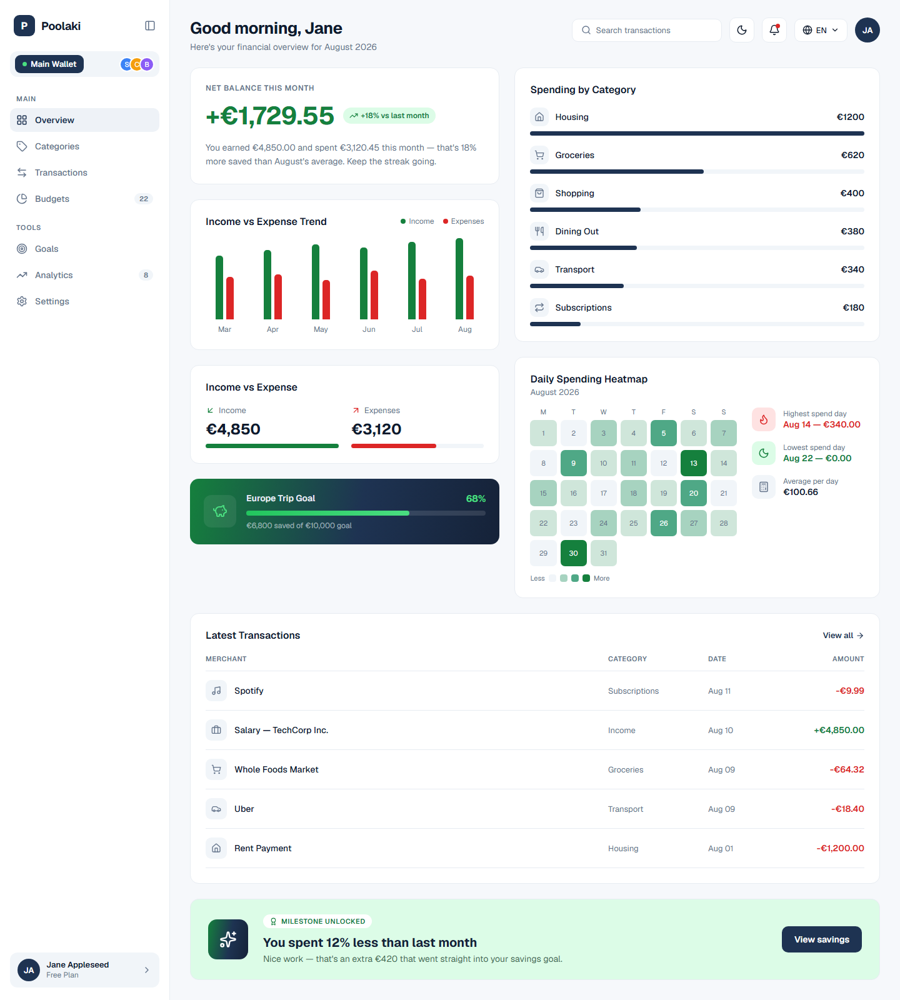
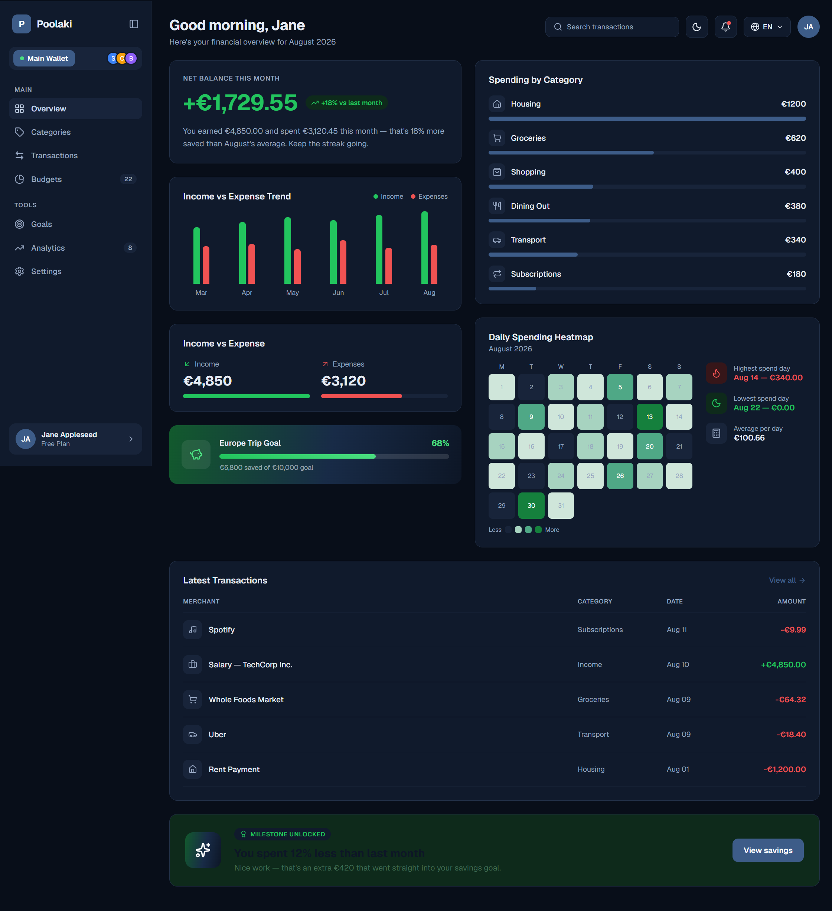
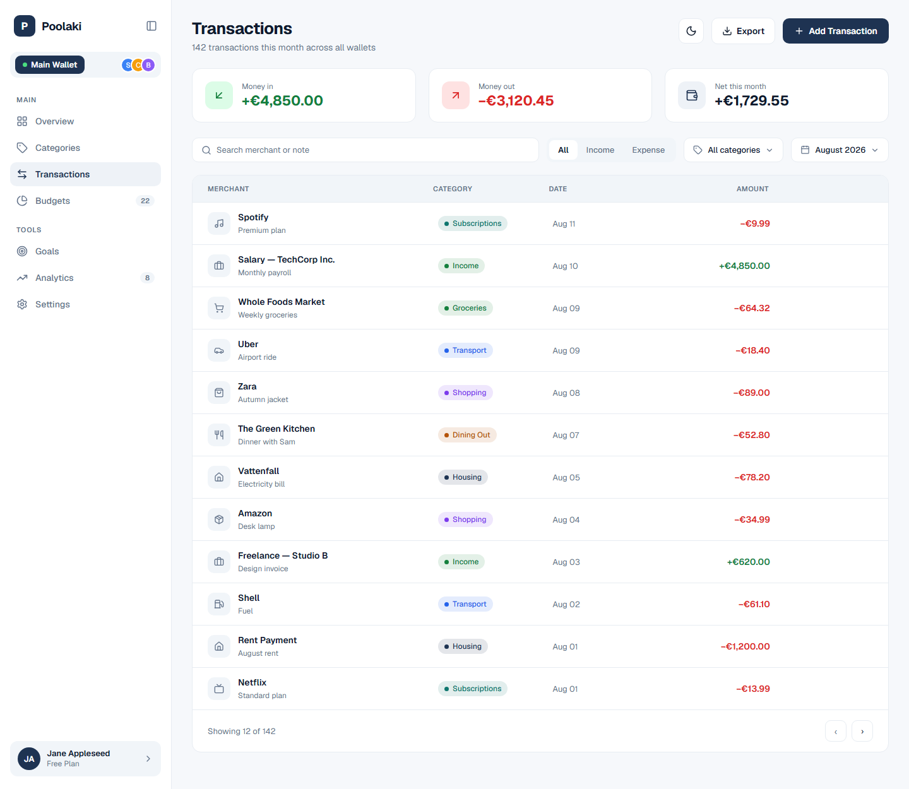
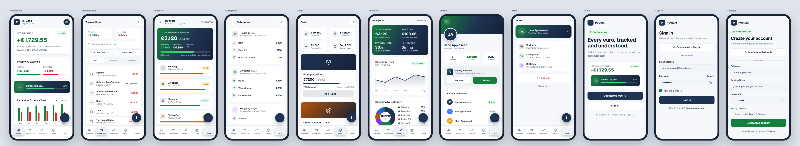

# Design Reference

These files are the visual source of truth for the
frontend: colors, component shapes, and interaction patterns should be taken from here
rather than reinvented per screen.

Rebuild with [shadcn/ui](https://ui.shadcn.com/)
components (see [Implementing the design](#implementing-the-design)).

## Screens

### Desktop

| Screen | File | Purpose |
|---|---|---|
| Home | [home.html](desktop/home.html) | Landing / marketing page |
| Sign In | [sign-in.html](desktop/sign-in.html) | Authentication |
| Sign Up | [sign-up.html](desktop/sign-up.html) | Registration |
| Dashboard | [dashboard.html](desktop/dashboard.html) | Overview, balances, recent activity |
| Transactions | [transactions.html](desktop/transactions.html) | Transaction list, filtering |
| Categories | [categories.html](desktop/categories.html) | Category management |
| Budgets | [budgets.html](desktop/budgets.html) | Budget planning and progress |
| Goals | [goals.html](desktop/goals.html) | Savings goals |
| Analytics | [analytics.html](desktop/analytics.html) | Charts and spending breakdown |
| Profile | [profile.html](desktop/profile.html) | Account settings |

### Mobile

| Screen | File | Purpose |
|---|---|---|
| Mobile flow | [mobile.html](mobile/mobile.html) | All eleven mobile screens as phone frames |

`mobile.html` is not a phone-viewport page — it is a wide showcase canvas holding eleven
phone frames side by side: Dashboard, Transactions, Budgets, Categories, Goals,
Analytics, Profile, More, Home, Sign In, and Register. Open it maximised and scroll
horizontally.

## Preview

Static exports, for orientation only — the HTML files are the source of truth.

**Dashboard, light** — sidebar, stat cards, charts, and the green-to-navy gradient goal
card.

**Dashboard, dark** — the same screen with the `.dark` class applied, showing how the
token pairs in the tables below resolve in practice.

**Transactions** — the densest layout, and the one most likely to be rebuilt wrong.

**Mobile** — all eleven frames. Open the file itself to read any of them properly.

## Design tokens

Every prototype defines the same token set as CSS custom properties: light theme on
`:root`, dark theme on `.dark`. This is the same class-based mechanism shadcn/ui uses,
so these values port over directly.

### Core

| Token | Light | Dark | Role |
|---|---|---|---|
| `--bg` | `#f6f8fb` | `#080e19` | Page background |
| `--fg` | `#0f1b2d` | `#e6ecf5` | Body text |
| `--card` | `#ffffff` | `#101a2c` | Card / panel surface |
| `--border` | `#e7ecf2` | `#233149` | Dividers, card outlines, inputs |
| `--primary` | `#1e3352` | `#3d5c88` | Primary actions, brand navy |
| `--primary-fg` | `#ffffff` | `#ffffff` | Text on primary |
| `--muted` | `#f1f5f9` | `#18243a` | Subdued surface (table headers, wells) |
| `--muted-fg` | `#64748b` | `#94a4bf` | Secondary text, labels |
| `--accent` | `#eef2f7` | `#18243b` | Hover / selected state |
| `--accent-fg` | `#1e3352` | `#c7d6ec` | Text on accent |
| `--ring` | `#94a3b8` | `#3d5c88` | Focus ring |

### Status

| Token | Light | Dark | Role |
|---|---|---|---|
| `--success` | `#15803d` | `#22c55e` | Income, positive delta, goal met |
| `--success-bg` | `#dcfce7` | `#0e2a1b` | Success badge background |
| `--danger` | `#dc2626` | `#f05252` | Expense, over budget, destructive |
| `--danger-bg` | `#fee2e2` | `#361619` | Danger badge background |

Note the deliberate inversion: status foregrounds get **lighter** in dark mode while
their backgrounds get **darker**, keeping contrast on both themes. Preserve that
relationship rather than reusing one theme's values for both.

### Brand

| Token | Light | Dark |
|---|---|---|
| `--navy` | `#152238` | `#0d1626` |
| `--grad` | `linear-gradient(100deg, #15803d 0%, #1e3352 55%, #152238 100%)` | `linear-gradient(100deg, #125a2d 0%, #182b47 55%, #0d1626 100%)` |

`--grad` is the signature green-to-navy gradient used on hero surfaces and primary
balance cards. `--navy` is the fixed brand shade for the sidebar and dark panels — it is
not derived from `--primary` and should not drift from it.

### Shape and type

| Property | Value |
|---|---|
| `--radius` | `14px` |
| Font | `Geist`, falling back to `system-ui, -apple-system, sans-serif` |
| Icons | [Lucide](https://lucide.dev/) |

The `14px` radius is noticeably softer than the shadcn/ui default of `0.5rem` (8px) —
set it explicitly or the whole UI will read as sharper than the design.

There is no spacing scale in the prototypes — `--radius` is the only geometry token, so
padding and gaps have to be measured off the designs.

## Implementing the design

Build the UI from [shadcn/ui](https://ui.shadcn.com/) components rather than
hand-rolling — the prototypes were designed around that component vocabulary (cards,
tables, dialogs, badges, tabs, sheets), and the frontend stack already matches what
shadcn/ui targets.

### Token mapping

The prototype tokens map almost one-to-one onto shadcn/ui's. Translate them in
`frontend/app/globals.css`:

| Prototype token | shadcn/ui token |
|---|---|
| `--bg` | `--background` |
| `--fg` | `--foreground`, `--card-foreground`, `--popover-foreground` |
| `--card` | `--card`, `--popover` |
| `--border` | `--border`, `--input` |
| `--primary` | `--primary` |
| `--primary-fg` | `--primary-foreground` |
| `--muted` | `--muted`, `--secondary` |
| `--muted-fg` | `--muted-foreground`, `--secondary-foreground` |
| `--accent` | `--accent` |
| `--accent-fg` | `--accent-foreground` |
| `--ring` | `--ring` |
| `--danger` | `--destructive` |
| `--radius` | `--radius` (set to `14px`, not the `0.5rem` default) |

**Gaps to fill manually** — shadcn/ui has no equivalent for these, so add them as custom
tokens: `--success`, `--success-bg`, `--danger-bg`, `--navy`, `--grad`. Income/expense
coloring runs through the whole app, so define `--success` properly instead of reaching
for an arbitrary Tailwind green at each call site.

