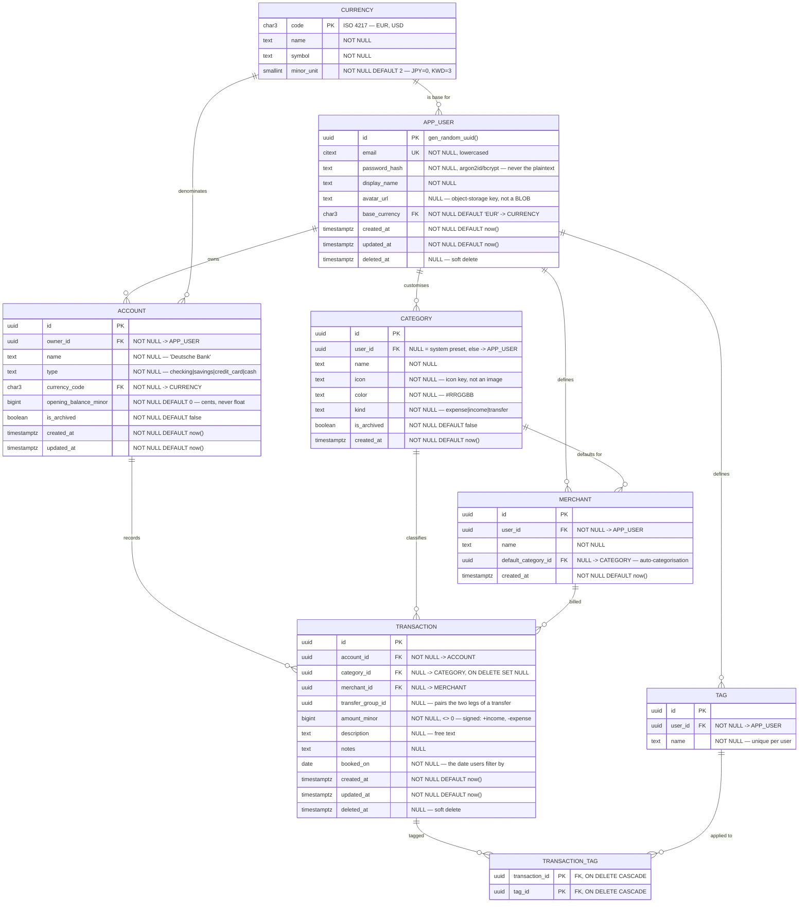

# Entity diagram

MVP scope: one owner per account, no planning features, no recurring transactions.

```mermaid
erDiagram

    %% ── Identity ────────────────────────────────────────────────────────────
    %% 'user' is reserved in Postgres — table is app_user
    APP_USER {
        uuid        id                  PK  "gen_random_uuid()"
        citext      email               UK  "NOT NULL, lowercased"
        text        password_hash           "NOT NULL, argon2id/bcrypt — never the plaintext"
        text        display_name            "NOT NULL"
        text        avatar_url              "NULL — object-storage key, not a BLOB"
        char3       base_currency       FK  "NOT NULL DEFAULT 'EUR' -> CURRENCY"
        timestamptz created_at              "NOT NULL DEFAULT now()"
        timestamptz updated_at              "NOT NULL DEFAULT now()"
        timestamptz deleted_at              "NULL — soft delete"
    }

    %% ── Money containers ────────────────────────────────────────────────────
    CURRENCY {
        char3       code                PK  "ISO 4217 — EUR, USD"
        text        name                    "NOT NULL"
        text        symbol                  "NOT NULL"
        smallint    minor_unit              "NOT NULL DEFAULT 2 — JPY=0, KWD=3"
    }

    ACCOUNT {
        uuid        id                  PK
        uuid        owner_id            FK  "NOT NULL -> APP_USER"
        text        name                    "NOT NULL — 'Deutsche Bank'"
        text        type                    "NOT NULL — checking|savings|credit_card|cash"
        char3       currency_code       FK  "NOT NULL -> CURRENCY"
        bigint      opening_balance_minor   "NOT NULL DEFAULT 0 — cents, never float"
        boolean     is_archived             "NOT NULL DEFAULT false"
        timestamptz created_at              "NOT NULL DEFAULT now()"
        timestamptz updated_at              "NOT NULL DEFAULT now()"
    }

    %% ── Classification ──────────────────────────────────────────────────────
    CATEGORY {
        uuid        id                  PK
        uuid        user_id             FK  "NULL = system preset, else -> APP_USER"
        text        name                    "NOT NULL"
        text        icon                    "NOT NULL — icon key, not an image"
        text        color                   "NOT NULL — #RRGGBB"
        text        kind                    "NOT NULL — expense|income|transfer"
        boolean     is_archived             "NOT NULL DEFAULT false"
        timestamptz created_at              "NOT NULL DEFAULT now()"
    }

    MERCHANT {
        uuid        id                  PK
        uuid        user_id             FK  "NOT NULL -> APP_USER"
        text        name                    "NOT NULL"
        uuid        default_category_id FK  "NULL -> CATEGORY — auto-categorisation"
        timestamptz created_at              "NOT NULL DEFAULT now()"
    }

    %% ── The ledger ──────────────────────────────────────────────────────────
    TRANSACTION {
        uuid        id                  PK
        uuid        account_id          FK  "NOT NULL -> ACCOUNT"
        uuid        category_id         FK  "NULL -> CATEGORY, ON DELETE SET NULL"
        uuid        merchant_id         FK  "NULL -> MERCHANT"
        uuid        transfer_group_id       "NULL — pairs the two legs of a transfer"
        bigint      amount_minor            "NOT NULL, <> 0 — signed: +income, -expense"
        text        description             "NULL — free text"
        text        notes                   "NULL"
        date        booked_on               "NOT NULL — the date users filter by"
        timestamptz created_at              "NOT NULL DEFAULT now()"
        timestamptz updated_at              "NOT NULL DEFAULT now()"
        timestamptz deleted_at              "NULL — soft delete"
    }

    TAG {
        uuid        id                  PK
        uuid        user_id             FK  "NOT NULL -> APP_USER"
        text        name                    "NOT NULL — unique per user"
    }

    TRANSACTION_TAG {
        uuid        transaction_id      PK  "FK, ON DELETE CASCADE"
        uuid        tag_id              PK  "FK, ON DELETE CASCADE"
    }

    %% ── Relationships ───────────────────────────────────────────────────────
    CURRENCY    ||--o{ APP_USER        : "is base for"

    APP_USER    ||--o{ ACCOUNT         : "owns"
    CURRENCY    ||--o{ ACCOUNT         : "denominates"

    ACCOUNT     ||--o{ TRANSACTION     : "records"
    CATEGORY    ||--o{ TRANSACTION     : "classifies"
    MERCHANT    ||--o{ TRANSACTION     : "billed"

    APP_USER    ||--o{ CATEGORY        : "customises"
    APP_USER    ||--o{ MERCHANT        : "defines"
    CATEGORY    ||--o{ MERCHANT        : "defaults for"

    TRANSACTION ||--o{ TRANSACTION_TAG : "tagged"
    TAG         ||--o{ TRANSACTION_TAG : "applied to"
    APP_USER    ||--o{ TAG             : "defines"
```
