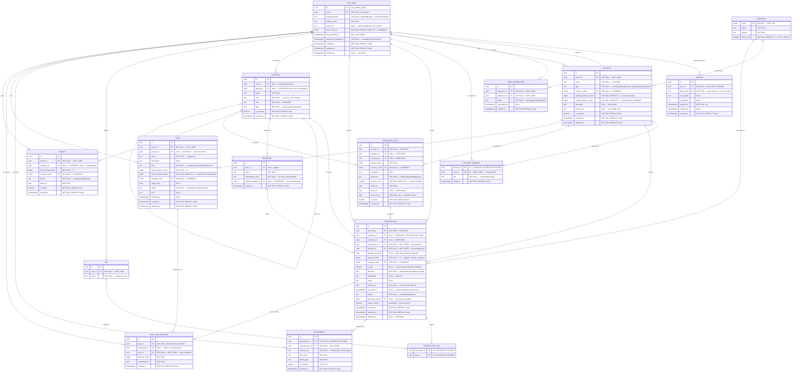

# Entity diagram

Full scope: multiple owners per account, planning and goals features, recurring transactions.

```mermaid
erDiagram

    %% ── Identity ────────────────────────────────────────────────────────────
    %% 'user' is reserved in Postgres — table is app_user
    APP_USER {
        uuid        id                  PK  "gen_random_uuid()"
        citext      email               UK  "NOT NULL, lowercased"
        text        password_hash           "NOT NULL, argon2id/bcrypt — never the plaintext"
        text        display_name            "NOT NULL"
        text        avatar_url              "NULL — object-storage key, not a BLOB"
        char3       base_currency           "NOT NULL DEFAULT 'EUR', FK -> CURRENCY"
        timestamptz email_verified_at       "NULL until verified"
        timestamptz password_changed_at     "NOT NULL — invalidates older sessions"
        timestamptz created_at              "NOT NULL DEFAULT now()"
        timestamptz updated_at              "NOT NULL DEFAULT now()"
        timestamptz deleted_at              "NULL — soft delete"
    }

    SESSION {
        uuid        id                  PK
        uuid        user_id             FK  "NOT NULL, ON DELETE CASCADE"
        text        token_hash          UK  "NOT NULL — store the hash, never the token"
        text        user_agent              "NULL"
        inet        ip_address              "NULL"
        timestamptz expires_at              "NOT NULL, idx"
        timestamptz revoked_at              "NULL"
        timestamptz created_at              "NOT NULL DEFAULT now()"
    }

    %% ── Social graph: 'Other users' ─────────────────────────────────────────
    USER_CONNECTION {
        uuid        id                  PK
        uuid        requester_id        FK  "NOT NULL -> APP_USER"
        uuid        addressee_id        FK  "NOT NULL -> APP_USER"
        text        status                  "NOT NULL — pending|accepted|blocked"
        timestamptz responded_at            "NULL"
        timestamptz created_at              "NOT NULL DEFAULT now()"
    }

    %% ── Money containers ────────────────────────────────────────────────────
    CURRENCY {
        char3       code                PK  "ISO 4217 — EUR, USD"
        text        name                    "NOT NULL"
        text        symbol                  "NOT NULL"
        smallint    minor_unit              "NOT NULL DEFAULT 2 — JPY=0, KWD=3"
    }

    ACCOUNT {
        uuid        id                  PK
        uuid        owner_id            FK  "NOT NULL -> APP_USER"
        text        name                    "NOT NULL — 'Joint DKB'"
        text        type                    "NOT NULL — checking|savings|credit_card|cash|investment|loan"
        char3       currency_code       FK   "NOT NULL -> CURRENCY"
        bigint      opening_balance_minor   "NOT NULL DEFAULT 0 — cents, never float"
        bigint      cached_balance_minor    "NOT NULL DEFAULT 0 — denormalised, rebuildable"
        text        institution             "NULL — bank name"
        text        account_ref             "NULL — last 4 digits only"
        boolean     is_archived             "NOT NULL DEFAULT false"
        timestamptz created_at              "NOT NULL DEFAULT now()"
        timestamptz updated_at              "NOT NULL DEFAULT now()"
    }

    ACCOUNT_MEMBER {
        uuid        account_id          PK  "FK -> ACCOUNT, ON DELETE CASCADE"
        uuid        user_id             PK  "FK -> APP_USER — composite PK"
        text        role                    "NOT NULL — owner|editor|viewer"
        timestamptz joined_at               "NOT NULL DEFAULT now()"
    }

    %% ── Classification ──────────────────────────────────────────────────────
    CATEGORY {
        uuid        id                  PK
        uuid        user_id             FK  "NULL = system/global preset"
        uuid        parent_id           FK  "NULL -> CATEGORY, self-ref for sub-categories"
        text        name                    "NOT NULL"
        text        icon                    "NOT NULL — icon key, not an image"
        text        color                   "NOT NULL — #RRGGBB"
        text        kind                    "NOT NULL — expense|income|transfer"
        boolean     is_archived             "NOT NULL DEFAULT false"
        timestamptz created_at              "NOT NULL DEFAULT now()"
    }

    MERCHANT {
        uuid        id                  PK
        uuid        user_id             FK  "NULL = global"
        text        name                    "NOT NULL"
        text        normalized_name         "NOT NULL — for fuzzy match/dedupe"
        uuid        default_category_id FK  "NULL -> CATEGORY — auto-categorisation"
        timestamptz created_at              "NOT NULL DEFAULT now()"
    }

    %% ── The ledger ──────────────────────────────────────────────────────────
    TRANSACTION {
        uuid        id                  PK
        uuid        account_id          FK  "NOT NULL -> ACCOUNT"
        uuid        category_id         FK  "NULL -> CATEGORY, ON DELETE SET NULL"
        uuid        merchant_id         FK  "NULL -> MERCHANT"
        uuid        created_by_id       FK  "NOT NULL -> APP_USER — who entered it"
        uuid        paid_by_id          FK  "NOT NULL -> APP_USER — who actually paid"
        uuid        transfer_group_id       "NULL — pairs the two legs of a transfer"
        bigint      amount_minor            "NOT NULL, <> 0 — signed: +income, -expense"
        char3       currency_code       FK  "NOT NULL -> CURRENCY"
        numeric     fx_rate                 "NULL — rate to account currency if differing"
        text        direction               "NOT NULL — debit|credit (derivable from sign)"
        text        description             "NULL — free text"
        text        notes                   "NULL"
        date        booked_on               "NOT NULL — the date users filter by"
        timestamptz occurred_at             "NULL — precise timestamp when known"
        text        status                  "NOT NULL — pending|cleared|void"
        uuid        recurring_rule_id   FK  "NULL — set if auto-generated"
        tsvector    search_vector           "generated — full-text search"
        timestamptz created_at              "NOT NULL DEFAULT now()"
        timestamptz updated_at              "NOT NULL DEFAULT now()"
        timestamptz deleted_at              "NULL — soft delete"
    }

    TAG {
        uuid        id                  PK
        uuid        user_id             FK  "NOT NULL -> APP_USER"
        text        name                    "NOT NULL — unique per user"
    }

    TRANSACTION_TAG {
        uuid        transaction_id      PK  "FK, ON DELETE CASCADE"
        uuid        tag_id              PK  "FK, ON DELETE CASCADE"
    }

    ATTACHMENT {
        uuid        id                  PK
        uuid        transaction_id      FK  "NOT NULL, ON DELETE CASCADE"
        uuid        uploaded_by_id      FK  "NOT NULL -> APP_USER"
        text        storage_key             "NOT NULL — S3/disk path, not the bytes"
        text        file_name               "NOT NULL"
        text        mime_type               "NOT NULL"
        integer     size_bytes              "NOT NULL"
        timestamptz created_at              "NOT NULL DEFAULT now()"
    }

    RECURRING_RULE {
        uuid        id                  PK
        uuid        account_id          FK  "NOT NULL -> ACCOUNT"
        uuid        category_id         FK  "NULL -> CATEGORY"
        uuid        merchant_id         FK  "NULL -> MERCHANT"
        bigint      amount_minor            "NOT NULL"
        char3       currency_code       FK  "NOT NULL -> CURRENCY"
        text        description             "NULL"
        text        frequency               "NOT NULL — daily|weekly|monthly|yearly"
        smallint    interval_count          "NOT NULL DEFAULT 1 — every N periods"
        date        starts_on               "NOT NULL"
        date        ends_on                 "NULL — open-ended"
        date        next_run_on             "NOT NULL, idx — scheduler cursor"
        boolean     is_active               "NOT NULL DEFAULT true"
        timestamptz created_at              "NOT NULL DEFAULT now()"
    }

    %% ── Planning ────────────────────────────────────────────────────────────
    GOAL {
        uuid        id                  PK
        uuid        owner_id            FK  "NOT NULL -> APP_USER"
        uuid        account_id          FK  "NULL -> ACCOUNT — fund it from here"
        text        name                    "NOT NULL — 'Japan trip'"
        text        description             "NULL"
        text        kind                    "NOT NULL — saving|debt_payoff|spending_limit"
        bigint      target_amount_minor     "NOT NULL, > 0"
        bigint      current_amount_minor    "NOT NULL DEFAULT 0 — cached from contributions"
        char3       currency_code       FK  "NOT NULL -> CURRENCY"
        date        target_date             "NULL"
        text        status                  "NOT NULL — active|achieved|abandoned"
        text        icon                    "NULL"
        timestamptz achieved_at             "NULL"
        timestamptz created_at              "NOT NULL DEFAULT now()"
        timestamptz updated_at              "NOT NULL DEFAULT now()"
    }

    GOAL_CONTRIBUTION {
        uuid        id                  PK
        uuid        goal_id             FK  "NOT NULL, ON DELETE CASCADE"
        uuid        transaction_id      FK  "NULL — link to a real transaction"
        uuid        user_id             FK  "NOT NULL -> APP_USER — who contributed"
        bigint      amount_minor            "NOT NULL"
        date        contributed_on          "NOT NULL"
        timestamptz created_at              "NOT NULL DEFAULT now()"
    }

    BUDGET {
        uuid        id                  PK
        uuid        owner_id            FK  "NOT NULL -> APP_USER"
        uuid        category_id         FK  "NULL -> CATEGORY, NULL = overall budget"
        bigint      limit_amount_minor      "NOT NULL, > 0"
        char3       currency_code       FK  "NOT NULL -> CURRENCY"
        text        period                  "NOT NULL — weekly|monthly|yearly"
        date        starts_on               "NOT NULL"
        boolean     is_active               "NOT NULL DEFAULT true"
        timestamptz created_at              "NOT NULL DEFAULT now()"
    }

    %% ── Relationships ───────────────────────────────────────────────────────
    APP_USER        ||--o{ SESSION           : "authenticates via"
    APP_USER        ||--o{ USER_CONNECTION   : "requests"
    APP_USER        ||--o{ USER_CONNECTION   : "receives"

    APP_USER        ||--o{ ACCOUNT           : "owns"
    APP_USER        ||--o{ ACCOUNT_MEMBER    : "is member of"
    ACCOUNT         ||--o{ ACCOUNT_MEMBER    : "shared with"
    CURRENCY        ||--o{ ACCOUNT           : "denominates"

    ACCOUNT         ||--o{ TRANSACTION       : "records"
    APP_USER        ||--o{ TRANSACTION       : "created"
    APP_USER        ||--o{ TRANSACTION       : "paid for"
    CATEGORY        ||--o{ TRANSACTION       : "classifies"
    CATEGORY        ||--o{ CATEGORY          : "parent of"
    APP_USER        ||--o{ CATEGORY          : "customises"
    MERCHANT        ||--o{ TRANSACTION       : "billed"
    CATEGORY        ||--o{ MERCHANT          : "defaults for"
    CURRENCY        ||--o{ TRANSACTION       : "denominates"

    TRANSACTION     ||--o{ TRANSACTION_TAG   : "tagged"
    TAG             ||--o{ TRANSACTION_TAG   : "applied to"
    APP_USER        ||--o{ TAG               : "defines"
    TRANSACTION     ||--o{ ATTACHMENT        : "supported by"
    APP_USER        ||--o{ ATTACHMENT        : "uploaded"

    RECURRING_RULE  ||--o{ TRANSACTION       : "generates"
    ACCOUNT         ||--o{ RECURRING_RULE    : "scheduled on"
    CATEGORY        ||--o{ RECURRING_RULE    : "classifies"

    APP_USER        ||--o{ GOAL              : "sets"
    ACCOUNT         ||--o{ GOAL              : "funds"
    GOAL            ||--o{ GOAL_CONTRIBUTION : "progresses via"
    TRANSACTION     ||--o| GOAL_CONTRIBUTION : "counts toward"
    APP_USER        ||--o{ GOAL_CONTRIBUTION : "contributes"

    APP_USER        ||--o{ BUDGET            : "plans"
    CATEGORY        ||--o{ BUDGET            : "caps"
```
